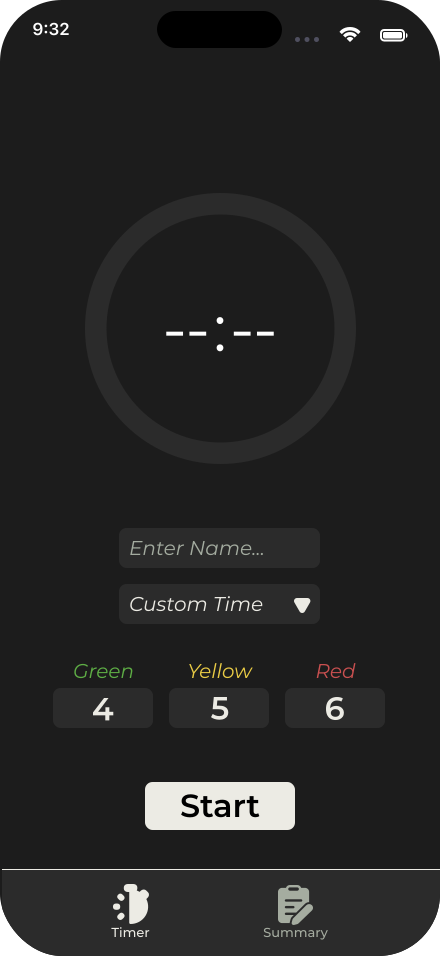
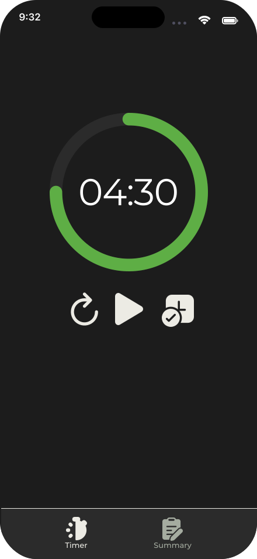
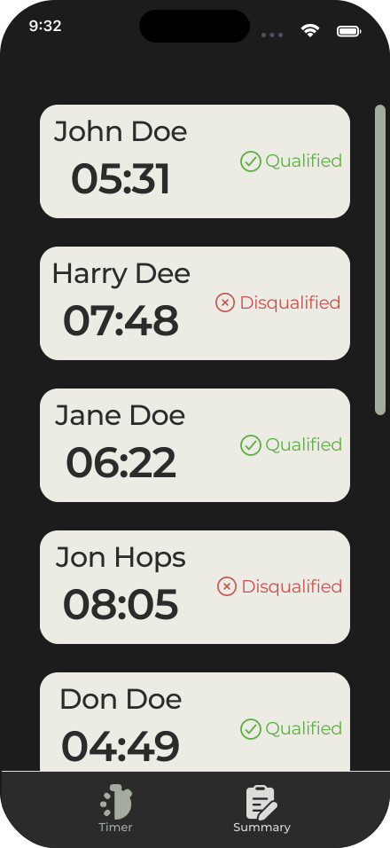

# ToastTime

ToastTime is an application that is made to help the time tracker in a Toastmaster session, giving visual and haptic feedback to notify the time tracker instead of focusing only on the time, which hinders their ability to engage with the speech.
  
